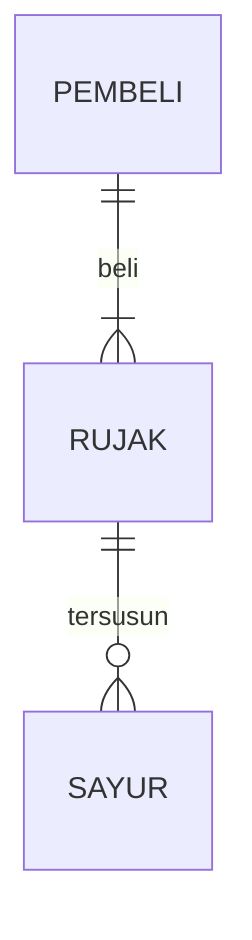

## 1.1 Latar Belakang

Perkembangan dalam bidang digital marketing terus berlanjut seiring dengan evolusi teknologi, perilaku konsumen, dan strategi pemasaran. Perkembangan digital marketing ini mencerminkan perubahan dalam perilaku konsumen dan teknologi yang semakin canggih. Pemasar yang sukses harus tetap up-to-date dengan tren ini dan mampu beradaptasi dengan cepat.

## 1.2. Deksripsi Teknologi Informasi

di aplikasi kali ini saya menggunakan beberapa teknologi informasi yaitu
1. HTML,CSS dan JAVASCRIPT sebagai elemen dasar web
2. dan saya menggunakan VISUAL STUDIO CODE sebagai pembuat programnya  

## 1.3. Branding

•	nama merk: pizzjo
•	tagline: "viva la pizza"
•	target user: Usia 18+
    -Seorang yang senang dengan makanan eropa 
    -Seorang yang senang mengeksplorasi marketing digital
    -Seorang yang ingin atau sudah memiliki sikap bertanggung jawab
    -Seorang yang ingin media cuitan alternatif yang lebih sehat
• User experience theme:
    Mudah
    Sederhana
    Menyenangkan
    Inspirasi desain:

## 2. User Story

sebagai | saya ingin | sehingga | prioritas
---|---|---|---
pengguna | bisa melihat daftar produk | bisa memilih produk yang tersedia ditoko | ⭐⭐⭐⭐⭐
---|---|---|---
pengguna | mencari menu | memudahkan menemukan produk dalam menu | ⭐⭐⭐⭐⭐
---|---|---|---
pengguna | memasukan alamat | memudahkan menentukan alamat paket | ⭐⭐⭐⭐⭐
---|---|---|---
pengguna | membeli produk | dapat menikmati produk | ⭐⭐⭐⭐⭐
---|---|---|---
pengguna | melihat sejarah singkat pizza | mengetahui sejarah singkat pizza  | ⭐⭐⭐⭐⭐
---      |---                            |---                                |---
pengguna | melihat harga produk | mengetahui harga | ⭐⭐⭐⭐⭐

## 3. Struktur Data

Cara membuat aneka macam bentuk grafik menggunakan mermaid.js bisa lihat di [https://mermaid.js.org/syntax/entityRelationshipDiagram.html](https://mermaid.js.org/syntax/entityRelationshipDiagram.html) 

## 4. Arsitektur Sistem

Masih pake mermaid.js juga bisa lihat flowchart di [https://mermaid.js.org/syntax/flowchart.html](https://mermaid.js.org/syntax/flowchart.html)

## 5. Teknologi, Library, dan Framework

bla bla bla

## 6. Desain User Experience dan User Interface

Bisa load image 

## 7. Demonstrasi Video

Link youtube nya

## 8. Bagaimana mesin komputasi dan sistem operasi berperan dalam produk teknologi informasimu ?

Link youtube nya di detik jawaban ini

## 9. Bagaimana algoritma, struktur data, dan bahasa pemrograman berperan dalam produk teknologi informasimu ?

Link youtube nya di detik jawaban ini

## 10. Bagaimana metode pengembangan perangkat lunak / Software Development Life Cycle berperan dalam produk teknologi informasimu ?

Link youtube nya di detik jawaban ini

## 11. Bagaimana database / sistem basis data berperan dalam produk teknologi informasimu ?

Link youtube nya di detik jawaban ini
