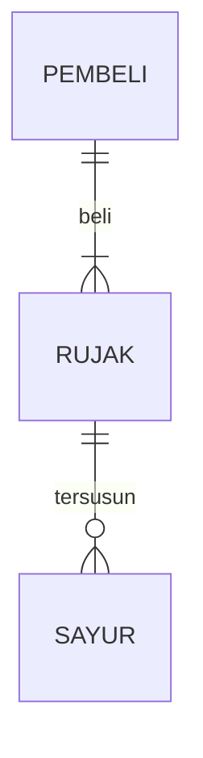

## 1.1 Latar Belakang

indonesia kaya akan suku,budaya dan kekeyaan alam.indonesia juga memiliki banyak seni budaya,baik seni rupa lukis,mural dan masih banyak lagi. karena tuhan memberikan kita keahlian dalam bidang atau bakat masing-masing,sayangnya banyak anak bangsa yang mempunyai keahlian lebih dalam seni, tapi terpendam sia-sia dan ada juga yang membuat karya bukan pada tempatnya,al hasil merugikan orang lain. menurut saya seni adalah karunia besar yang tuhan berikan pada kita,jika terus kita kembangkan,dan belum tentu dimiliki orang lain,hal ini memjadi salah satu penyebab saya membuat aplikasi ini                              
## 1.2. Deksripsi Teknologi Informasi

di aplikasi kali ini saya menggunakan beberapa teknologi informasi yaitu
1. HTML,CSS dan JAVASCRIPT sebagai elemen dasar web
2. dan saya menggunakan VISUAL STUDIO CODE sebagai pembuat programnya
3. untuk design nya saya menggunakan figma 

## 1.3. Branding

- nama merk :                                                                                                  
- tagline :                                               
- target user: 
    - Usia 18+                                                                                                
    - Seorang yang mencintai seni                                                                          
    - Seorang yang tidak ingin menjadikan bakat seninya sia-sia
    - Seorang yang ingin mengajar atau mempelajari lebih tentang seni
    - Seorang yang mempunyai bakat lebih di seni dan freelance
    - seorang yang ingin menjual atau membeli karya seni
    - seorang yang bersedia untuk ketika mendapat orderan untuk membuat karya seni 
- User experience theme:
   - Mudah
   - Sederhana
   - Menyenangkan
   - Inspirasi desain:
   - 

  

## 2. User Story

sebagai | saya ingin | sehingga | prioritas
---|---|---|---
pengguna | bisa melihat karya orang lain | bisa memilih karya orang lain | ⭐⭐⭐⭐⭐
pengguna | mencari karya orang lain | memudahkan menemukan karya orang lain | ⭐⭐⭐⭐⭐
pengguna | membuat akun | terdaftar dan bisa dilihat public | ⭐⭐⭐⭐⭐
pengguna | memesan orderan | membuat karya seni atau mural di tempat yang ditentukan client | ⭐⭐⭐⭐⭐
pengguna | mendapat orderan | bersedia memenuhi pesanan client | ⭐⭐⭐
pengguna | melihat harga produk | mengetahui harga | ⭐⭐⭐⭐
pengguna | melihat produk terbaru | mengetahui produk terbaru | ⭐⭐⭐⭐
pengguna | memasukan alamat | mengetahui dan memudahkan memenuhi pesanan client | ⭐⭐⭐⭐
pengguna | mengajarkan seni,lukis,mural,dll dalam bentuk video | memudahkan pecinta seni mengembangkan karyanya | ⭐⭐⭐⭐
pengguna | memesan orderan karya online | memenuhi pesanan client,seperti logo lambang dll | ⭐⭐⭐⭐

## 3. Struktur Data

1. pengguna                                                                                                        
    - ID Pengguna : ID untuk mengidentifikasi setiap pengguna.
    - Nama Pengguna : Nama pengguna yang digunakan untuk login.
    - Kata Sandi : Kata sandi yang dienkripsi untuk keamanan.
    - Nama Lengkap : Nama lengkap pengguna.
    - Alamat Email : Alamat email pengguna untuk komunikasi.
    - Nomor Telepon : Nomor telepon yang bisa dihubungi.
    - Daftar Karya Seni yang Dimiliki : Referensi ke karya seni yang dimiliki oleh pengguna.
    - Daftar Transaksi : Referensi ke transaksi yang telah dilakukan oleh pengguna.
2. karya seni
    - Judul : Judul karya seni.
    - Deskripsi : Deskripsi karya seni.
    - Seniman : Informasi tentang seniman yang menciptakan karya seni.
    - Harga : Harga yang diminta untuk karya seni.
    - Kategori : Kategori karya seni (misalnya lukisan, patung, fotografi, dll.).
3. transaksi                                                                                                              - Tanggal Transaksi : Tanggal transaksi dilakukan.
    - Status Transaksi : Status transaksi (misalnya sedang diproses, berhasil, dibatalkan, dll.).
    - Jumlah Pembayaran : Jumlah pembayaran yang dilakukan dalam transaksi.
    - jumlah karya : jumlah karya yang dibeli
      

## 4. Arsitektur Sistem

Masih pake mermaid.js juga bisa lihat flowchart di [https://mermaid.js.org/syntax/flowchart.html](https://mermaid.js.org/syntax/flowchart.html)

## 5. Teknologi, Library, dan Framework
Untuk teknologi pendukung saya menggunakan Visual Studio Code,dan figma 
## 6. Desain User Experience dan User Interface
https://www.figma.com/file/2nB9xwTZhvrbedETgT8ArN/Untitled?type=design&mode=design&t=rIx03clNE66dMtNL-0

## 8. Bagaimana mesin komputasi dan sistem operasi berperan dalam produk teknologi informasimu ?

Link youtube nya di detik jawaban ini

## 9. Bagaimana algoritma, struktur data, dan bahasa pemrograman berperan dalam produk teknologi informasimu ?

Link youtube nya di detik jawaban ini

## 10. Bagaimana metode pengembangan perangkat lunak / Software Development Life Cycle berperan dalam produk teknologi informasimu ?

Link youtube nya di detik jawaban ini

## 11. Bagaimana database / sistem basis data berperan dalam produk teknologi informasimu ?

Link youtube nya di detik jawaban ini
