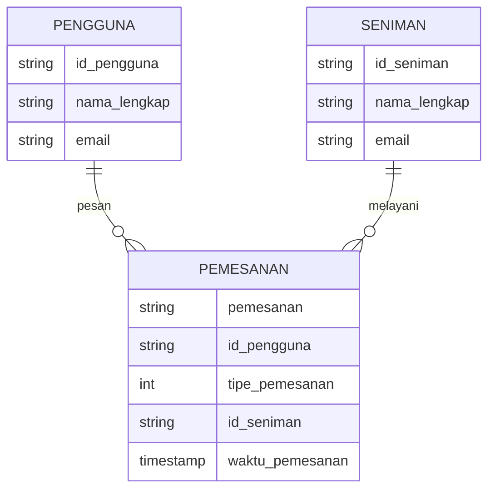

## 1.1 Latar Belakang

indonesia kaya akan suku,budaya dan kekeyaan alam.indonesia juga memiliki banyak seni budaya,baik seni rupa lukis,mural dan masih banyak lagi. karena tuhan memberikan kita keahlian dalam bidang atau bakat masing-masing,sayangnya banyak anak bangsa yang mempunyai keahlian lebih dalam seni, tapi terpendam sia-sia dan ada juga yang membuat karya bukan pada tempatnya,al hasil merugikan orang lain. menurut saya seni adalah karunia besar yang tuhan berikan pada kita,jika terus kita kembangkan,dan belum tentu dimiliki orang lain,hal ini memjadi salah satu penyebab saya membuat aplikasi ini                              
## 1.2. Deksripsi Teknologi Informasi

di aplikasi kali ini saya menggunakan beberapa teknologi informasi yaitu
1. HTML,CSS dan JAVASCRIPT sebagai elemen dasar web
2. dan saya menggunakan VISUAL STUDIO CODE sebagai pembuat programnya
3. untuk design nya saya menggunakan figma 

## 1.3. Branding

- nama merk : Sart                                                                                                 
- tagline : "Earth without art just eh"                                              
- target user: 
    - Usia 18+                                                                                                
    - Seorang yang mencintai seni                                                                          
    - Seorang yang tidak ingin menjadikan bakat seninya sia-sia
    - Seorang yang ingin mengajar atau mempelajari lebih tentang seni
    - Seorang yang mempunyai bakat lebih di seni dan freelance
    - seorang yang ingin menjual atau membeli karya seni
    - seorang yang bersedia untuk ketika mendapat orderan untuk membuat karya seni 
- User experience theme:
   - Mudah
   - Sederhana
   - Menyenangkan
   - Inspirasi desain:
   - 

  

## 2. User Story

sebagai | saya ingin | sehingga | prioritas
---|---|---|---
pengguna | melihat karya orang lain | dapat melihat karya orang lain | ⭐⭐⭐⭐⭐
pengguna | mencari karya akun seniman lain | dapat menemukan karya orang lain | ⭐⭐⭐⭐⭐
pengguna | membuat akun | terdaftar dalam data base | ⭐⭐⭐⭐⭐
pengguna | memberi nama pada input pengguna | mengisi nama sesuai keinginan pengguna | ⭐⭐⭐⭐
pengguna | mendaftarkan no hp | no hp terdaftar pada akun pengguna  | ⭐⭐⭐⭐⭐
pengguna | memasukan alamat | alamat terdaftar pada data base dan memudahkan memenuhi pesanan client | ⭐⭐⭐⭐
pengguna | memesan orderan | membuat karya seni atau mural di tempat yang ditentukan client | ⭐⭐⭐⭐⭐
pengguna | mendapat orderan | bersedia memenuhi pesanan client | ⭐⭐⭐
pengguna | melihat harga produk jika terdaftar pada deskripsi | mengetahui harga | ⭐⭐⭐⭐
pengguna | melihat produk terbaru | mengetahui produk terbaru | ⭐⭐⭐⭐
pengguna | mengajarkan seni,lukis,mural,dll dalam bentuk video | memudahkan pecinta seni mengembangkan karyanya | ⭐⭐⭐⭐
pengguna | memesan orderan karya online | memenuhi pesanan client | ⭐⭐⭐⭐
pengguna | maenghubungi seniman | memudahkan transaksi atau orderan | ⭐⭐⭐⭐
pengguna | membatalkan orderan karya online | pesanan client dibatalkan | ⭐⭐⭐⭐
pengguna | meng-edit profil | profil dapat diedit sesuai keinginan pengguna | ⭐⭐⭐⭐
pengguna | meng-edit profil | profil dapat diedit sesuai keinginan pengguna | ⭐⭐⭐⭐⭐
pengguna | meng-upload video dan foto hasil karya seniman | video dan foto hasil karya seniman dapat dilihat pengguna lainnya | ⭐⭐⭐⭐⭐
pengguna | mengedit video dan foto sebrlum di upload | pengguna dapat meng-edit sesuai keinginan pengguna | ⭐⭐⭐⭐
pengguna | menghapus video dan foto yang telah di-upload | video dan foto dapat dihapus | ⭐⭐⭐⭐
pengguna | memberi like untuk hasil upload video dan foto orang lain | video dan foto orang lain dapat di like |⭐⭐⭐⭐⭐
pengguna | mengkomentari video dan foto karya seniman | video dan foto seniman dapat dikomentari pengguna lain | ⭐⭐⭐⭐⭐
pengguna | mengubah ke dark mode | aplikasi menjadi dark mode | ⭐⭐⭐⭐⭐

1. pengguna                                                                                                        
    - ID Pengguna : ID untuk mengidentifikasi setiap pengguna.
    - Nama Pengguna : Nama pengguna yang digunakan untuk login.
    - Kata Sandi : Kata sandi yang dienkripsi untuk keamanan.
    - Nama Lengkap : Nama lengkap pengguna.
    - Alamat Email : Alamat email pengguna untuk komunikasi.
    - Nomor Telepon : Nomor telepon yang bisa dihubungi.
    - Daftar Karya Seni yang Dimiliki : Referensi ke karya seni yang dimiliki oleh pengguna.
    - Daftar Transaksi : Referensi ke transaksi yang telah dilakukan oleh pengguna.
2. karya seni
    - Judul : Judul karya seni.
    - Deskripsi : Deskripsi karya seni.
    - Seniman : Informasi tentang seniman yang menciptakan karya seni.
    - Harga : Harga yang diminta untuk karya seni.
    - Kategori : Kategori karya seni (misalnya lukisan, patung, fotografi, dll.).
3. transaksi                                                                                                              - Tanggal Transaksi : Tanggal transaksi dilakukan.
    - Status Transaksi : Status transaksi (misalnya sedang diproses, berhasil, dibatalkan, dll.).
    - Jumlah Pembayaran : Jumlah pembayaran yang dilakukan dalam transaksi.
    - jumlah karya : jumlah karya yang dibeli
## 3. Struktur Data

      

## 4. Arsitektur Sistem
memekai hardware,dan software

Masih pake mermaid.js juga bisa lihat flowchart di [https://mermaid.js.org/syntax/flowchart.html](https://mermaid.js.org/syntax/flowchart.html)

## 5. Teknologi, Library, dan Framework
Untuk teknologi pendukung saya menggunakan Visual Studio Code,dan figma 
## 6. Desain User Experience dan User Interface
## link figma
(https://www.figma.com/file/2nB9xwTZhvrbedETgT8ArN/Untitled?type=design&node-id=0-1&mode=design&t=5dLOo2zTx2nKlsiA-0)

## 7. Demonstrasi video
https://youtu.be/d3bl1NW4TnA
source code ;
https://github.com/Azispanji24/azis-job-interview-if

## 8. Bagaimana mesin komputasi dan sistem operasi berperan dalam produk teknologi informasimu ?
https://youtu.be/HRzMvnfzT_4

Mesin komputasi dan sistem operasi memainkan peran penting dalam eksekusi dan pengoperasian produk teknologi informasi yang menggunakan HTML, CSS, dan JavaScript. Berikut adalah cara keduanya berinteraksi dengan teknologi web:

Mesin Komputasi:
Eksekusi Kode JavaScript:

Mesin komputasi, seperti JavaScript Engine yang terdapat dalam browser (seperti V8 di Google Chrome), bertanggung jawab untuk mengeksekusi kode JavaScript yang terkandung dalam halaman web.
Pengolahan HTML dan CSS:

Mesin rendering di browser menginterpretasi dan memproses HTML untuk membangun struktur tata letak halaman dan mengaplikasikan gaya CSS untuk membuat tampilan yang diinginkan.
Sistem Operasi:
Manajemen Proses dan Sumber Daya:

Sistem operasi di latar belakang mengelola sumber daya perangkat keras dan memastikan alokasi yang efisien untuk aplikasi web yang berjalan.
Pengaturan Jaringan:

Sistem operasi menyediakan fungsionalitas untuk koneksi jaringan, memungkinkan aplikasi web untuk berkomunikasi dengan server atau layanan lainnya.
Manajemen Memori:

Sistem operasi mengelola penggunaan memori oleh browser dan aplikasi web. Ini termasuk alokasi dan dealokasi memori untuk menjaga keseimbangan dan kinerja yang optimal.
Interaksi Antara Keduanya:
Browser sebagai Antarmuka Pengguna:

Browser, yang menjalankan di atas sistem operasi, menyediakan antarmuka pengguna untuk berinteraksi dengan aplikasi web. Browser menampilkan elemen HTML, menerapkan gaya CSS, dan menjalankan skrip JavaScript.
Pengelolaan Proses dan Thread:

Sistem operasi memastikan manajemen proses dan thread yang diperlukan oleh browser untuk menjalankan aplikasi web. Ini termasuk penanganan thread JavaScript di latar belakang (seperti worker thread).
Keamanan dan Izin:

Sistem operasi menyediakan lapisan keamanan untuk melindungi sistem dan data pengguna dari ancaman. Browser, sebagai aplikasi di atas sistem operasi, juga menerapkan kebijakan keamanan yang ketat.
Interaksi dengan Perangkat Keras:

Sistem operasi memungkinkan browser untuk berinteraksi dengan perangkat keras seperti webcam, mikrofon, dan penyimpanan lokal.
Penting untuk dicatat bahwa HTML, CSS, dan JavaScript sendiri bersifat platform-independent, yang berarti mereka dapat dijalankan di berbagai sistem operasi dan mesin komputasi selama browser yang sesuai tersedia. Sehingga, kinerja dan pengalaman pengguna dari aplikasi web Anda dipengaruhi oleh implementasi browser dan sistem operasi yang digunakan.

## 9. Bagaimana algoritma, struktur data, dan bahasa pemrograman berperan dalam produk teknologi informasimu ?
https://youtu.be/WOG3vkvEpNo

Algoritma, struktur data, dan bahasa pemrograman berperan penting dalam pengembangan produk teknologi informasi pada web, termasuk dalam penggunaan HTML, CSS, dan JavaScript. Berikut adalah bagaimana ketiga konsep tersebut berkontribusi dalam pembuatan dan optimalisasi produk web:

1. Algoritma:
Pengolahan Data Efisien: Algoritma digunakan untuk memproses dan memanipulasi data pada sisi server atau sisi klien. Misalnya, algoritma pencarian, pengurutan, atau filtering data.
Optimisasi Kinerja: Algoritma dapat diimplementasikan untuk memastikan kinerja yang optimal dalam hal waktu eksekusi dan penggunaan sumber daya. Contohnya, algoritma pencarian yang efisien untuk mengakses data di database.
2. Struktur Data:
Organisasi Data: Struktur data membantu mengorganisasi dan menyimpan data dengan cara yang memungkinkan akses dan manipulasi yang efisien. Contohnya, menggunakan struktur data seperti array, objek, atau linked list di JavaScript.
Manipulasi DOM: Struktur data memainkan peran penting dalam manipulasi DOM (Document Object Model) menggunakan JavaScript. Menggunakan struktur data yang tepat dapat membuat interaksi dengan elemen HTML lebih efisien.
3. Bahasa Pemrograman:
HTML (Markup Language): Bahasa ini digunakan untuk membuat struktur dasar halaman web. HTML menentukan elemen-elemen seperti judul, paragraf, gambar, tautan, dll.
CSS (Stylesheet Language): Bahasa ini digunakan untuk mengatur tata letak dan gaya halaman web. CSS menentukan bagaimana elemen HTML ditampilkan di layar.
JavaScript (Programming Language): Bahasa pemrograman ini digunakan untuk memberikan interaktivitas dan dinamika pada halaman web. JavaScript dapat digunakan untuk manipulasi DOM, menanggapi interaksi pengguna, dan mengelola logika bisnis pada sisi klien.
Hubungan Antar Konsep:
Interaksi Dinamis: Algoritma dan struktur data diimplementasikan dalam JavaScript untuk mengatur dan memproses data secara dinamis pada sisi klien.
Pengolahan Server-Side: Algoritma dan struktur data digunakan di sisi server untuk mengolah data, memproses permintaan pengguna, dan memberikan respon yang diperlukan.
Optimisasi Kode: Pemilihan algoritma yang tepat dan penggunaan struktur data yang efisien dapat mempercepat kinerja aplikasi web.
Contoh:
Misalnya, jika Anda mengembangkan fitur pencarian pada situs web Anda, Anda dapat menerapkan algoritma pencarian seperti Binary Search (jika data terurut) untuk meningkatkan efisiensi. Struktur data seperti objek JavaScript juga dapat digunakan untuk menyimpan dan mengakses data dengan cara yang efisien.

## 10. Bagaimana metode pengembangan perangkat lunak / Software Development Life Cycle berperan dalam produk teknologi informasimu ?
https://youtu.be/cpJJkrr65Q0

Metode Pengembangan Perangkat Lunak (Software Development Life Cycle atau SDLC) berperan penting dalam pengembangan produk teknologi informasi, termasuk dalam konteks pengembangan situs web atau aplikasi web yang menggunakan HTML, CSS, dan JavaScript. SDLC memberikan kerangka kerja dan proses yang terstruktur untuk mengelola dan mengarahkan setiap tahapan dalam siklus pengembangan perangkat lunak. Berikut adalah beberapa cara SDLC berperan dalam produk teknologi informasi Anda:

Perencanaan (Planning):

Menentukan tujuan dan kebutuhan proyek, termasuk fitur dan fungsi yang diperlukan dalam situs web atau aplikasi.
Merencanakan sumber daya, anggaran, dan jadwal pengembangan.
Analisis (Analysis):

Menganalisis kebutuhan pengguna dan mengidentifikasi persyaratan fungsional dan non-fungsional.
Merinci kebutuhan desain dan tata letak yang diperlukan untuk situs web.
Desain (Design):

Merancang struktur dan tata letak halaman web menggunakan HTML dan CSS.
Merancang arsitektur perangkat lunak dan struktur kode JavaScript.
Implementasi (Implementation):

Menulis dan mengimplementasikan kode HTML, CSS, dan JavaScript sesuai dengan desain yang telah dibuat.
Mengembangkan halaman web dengan menggunakan praktik pengkodean terbaik dan standar.
Pengujian (Testing):

Melakukan pengujian fungsionalitas dan kinerja situs web atau aplikasi.
Menjalankan uji kesalahan dan memastikan bahwa produk berfungsi sesuai dengan yang diharapkan.
Pengelolaan Konfigurasi (Configuration Management):

Mengelola versi dan perubahan dalam kode sumber, termasuk HTML, CSS, dan JavaScript.
Menyelenggarakan kontrol versi untuk mengamankan dan melacak perubahan.
Peluncuran (Deployment):

Menerapkan situs web atau aplikasi ke server produksi.
Memastikan bahwa semua komponen HTML, CSS, dan JavaScript bekerja dengan baik di lingkungan produksi.
Pemeliharaan dan Dukungan (Maintenance and Support):

Memberikan dukungan teknis dan pemeliharaan setelah produk diluncurkan.
Mengelola perbaikan bug, peningkatan, dan pembaruan berdasarkan umpan balik pengguna atau perubahan kebutuhan.
Metode SDLC membantu dalam merencanakan, melaksanakan, dan mengelola proyek pengembangan perangkat lunak dengan lebih efisien dan efektif. Ini memberikan kerangka kerja untuk mengelola risiko, mengukur kemajuan, dan memastikan bahwa produk berkualitas sesuai dengan harapan dan kebutuhan pengguna.

## 11. Bagaimana database / sistem basis data berperan dalam produk teknologi informasimu ?
https://youtu.be/VKCG9dQJefw

Database atau sistem basis data memiliki peran penting dalam produk teknologi informasi, terutama jika produk tersebut melibatkan pengelolaan dan penyimpanan data. Dalam konteks HTML, CSS, dan JavaScript, database berperan sebagai penyimpanan data yang dapat diakses, diambil, dan dimanipulasi oleh aplikasi web. Berikut adalah beberapa cara database berinteraksi dengan HTML, CSS, dan JavaScript:

1. Penyimpanan dan Pengambilan Data:
HTML (Struktur): HTML digunakan untuk membuat struktur halaman web. Namun, data yang diperoleh dari database sering kali disematkan atau ditampilkan di dalam elemen HTML untuk ditampilkan kepada pengguna.

CSS (Tata Letak): CSS mengontrol tata letak dan gaya halaman web. Data yang ditarik dari database dapat diatur secara visual menggunakan CSS untuk memastikan tampilan yang sesuai.

JavaScript (Interaktivitas): JavaScript dapat digunakan untuk memanipulasi dan menampilkan data secara dinamis pada halaman web. Data dari database dapat dimuat dan diubah menggunakan JavaScript tanpa perlu memuat ulang halaman.

2. Interaksi dengan Server:
HTML (Formulir): Formulir HTML memungkinkan pengguna untuk mengirimkan data ke server. Data yang dikirim melalui formulir ini dapat disimpan atau diambil dari database.

CSS (Styling Form): CSS dapat digunakan untuk menata letak dan gaya formulir HTML, memberikan pengguna pengalaman yang lebih baik saat berinteraksi dengan data.

JavaScript (AJAX): JavaScript dapat digunakan untuk mengirim permintaan asinkron (AJAX) ke server, yang memungkinkan pengambilan data dari server tanpa harus memuat ulang seluruh halaman. Hal ini memungkinkan interaktivitas yang lebih baik dengan data.

3. Manajemen Sesi dan Otentikasi:
HTML (Formulir dan Sesi): Formulir HTML dapat digunakan untuk mengelola proses otentikasi. Data sesi dapat disimpan untuk mengidentifikasi pengguna dan menyimpan informasi otentikasi.

CSS (Styling): CSS dapat mengelola tampilan halaman otentikasi, memberikan tampilan yang bersih dan intuitif.

JavaScript (Validasi dan Pengolahan Sesi): JavaScript dapat digunakan untuk memvalidasi formulir otentikasi dan mengelola data sesi pada sisi klien.

4. Pemrosesan dan Logika Bisnis:
HTML (Formulir): Formulir HTML dapat digunakan untuk memasukkan data yang diperlukan untuk diproses oleh logika bisnis.

CSS (Styling Formulir): CSS dapat membantu menata letak dan penampilan formulir untuk memudahkan penggunaan.

JavaScript (Validasi dan Logika Bisnis): JavaScript dapat digunakan untuk validasi formulir dan mengimplementasikan logika bisnis pada sisi klien.

5. Penyimpanan Lokal (Local Storage):
HTML (Web Storage API): HTML menyediakan Web Storage API, yang dapat digunakan untuk menyimpan data lokal di perangkat pengguna.

CSS dan JavaScript (Manipulasi Tampilan): CSS dan JavaScript dapat digunakan untuk memanipulasi tampilan berdasarkan data yang disimpan lokal.

6. Keamanan:
HTML (SSL/TLS): HTML tidak secara langsung terlibat dalam keamanan, tetapi penggunaan protokol HTTPS (SSL/TLS) untuk mengamankan koneksi dapat diimplementasikan melalui HTML.

CSS (Tata Letak Aman): CSS dapat digunakan untuk memastikan tata letak yang aman dan responsif untuk meminimalkan risiko keamanan.

JavaScript (Validasi dan Enkripsi): JavaScript dapat digunakan untuk validasi input dan enkripsi data sebelum dikirim ke server.

Database atau sistem basis data berperan sebagai penyimpanan dan sumber data yang dapat diakses oleh aplikasi web. Penggunaan HTML, CSS, dan JavaScript membantu dalam merancang antarmuka pengguna, mengelola tampilan, dan meningkatkan interaktivitas, sementara database menyediakan fondasi yang kuat untuk pengelolaan data yang efisien dan dapat diandalkan. Kerjasama antara HTML, CSS, JavaScript, dan database membantu menciptakan produk teknologi informasi yang lengkap dan berfungsi dengan baik.

